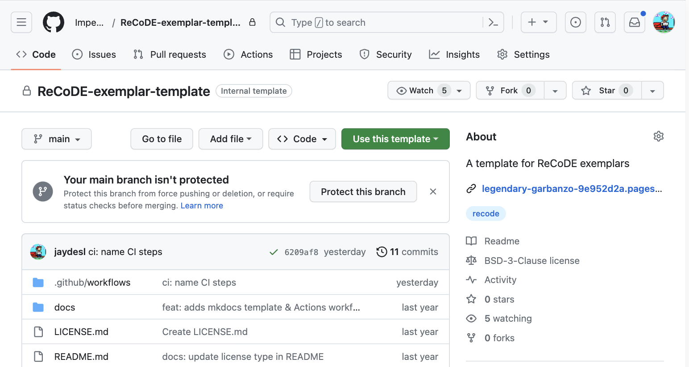
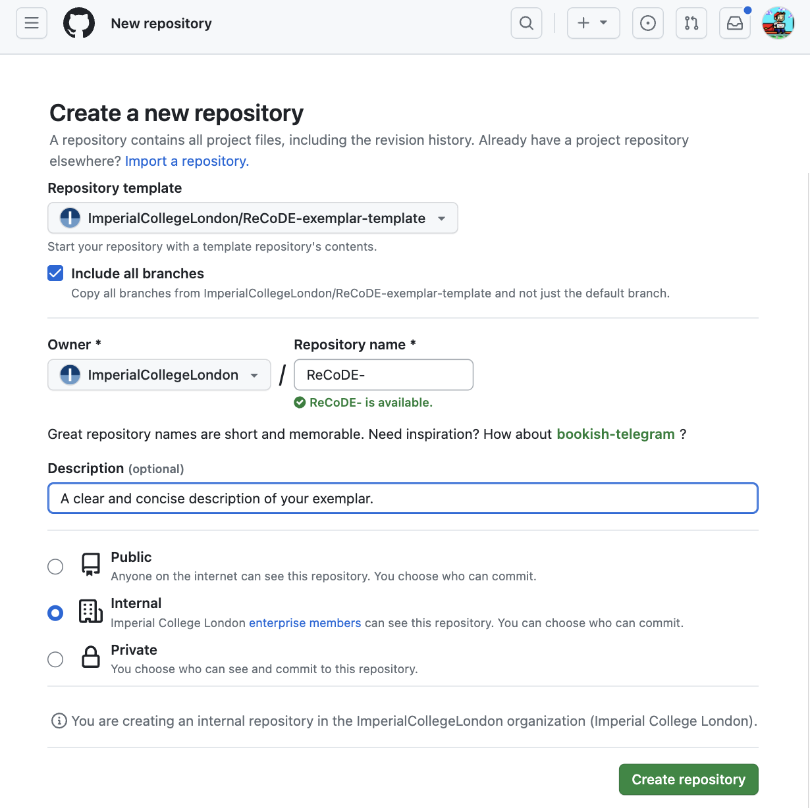
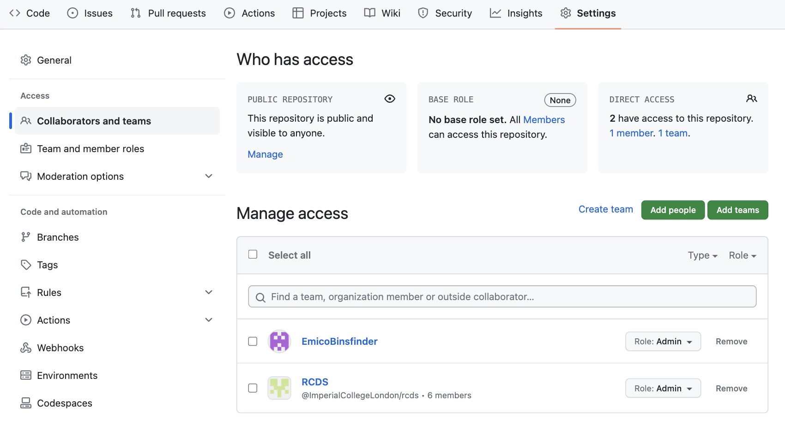
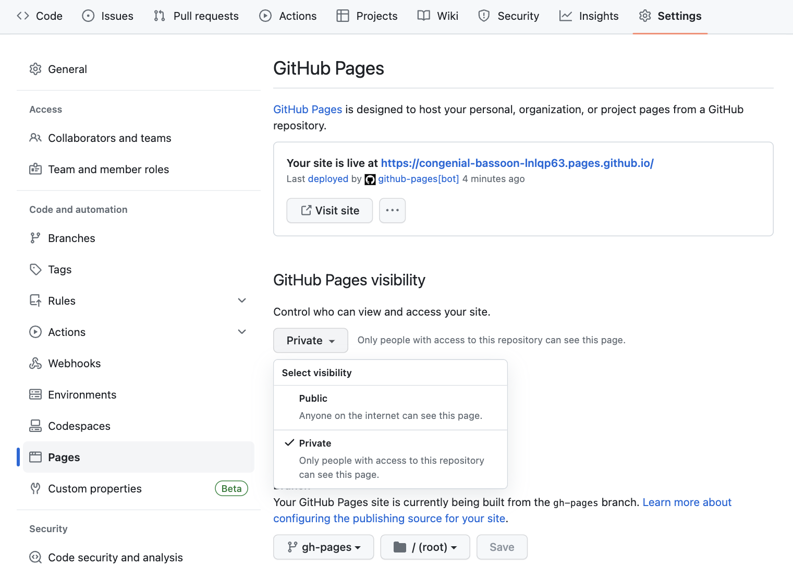
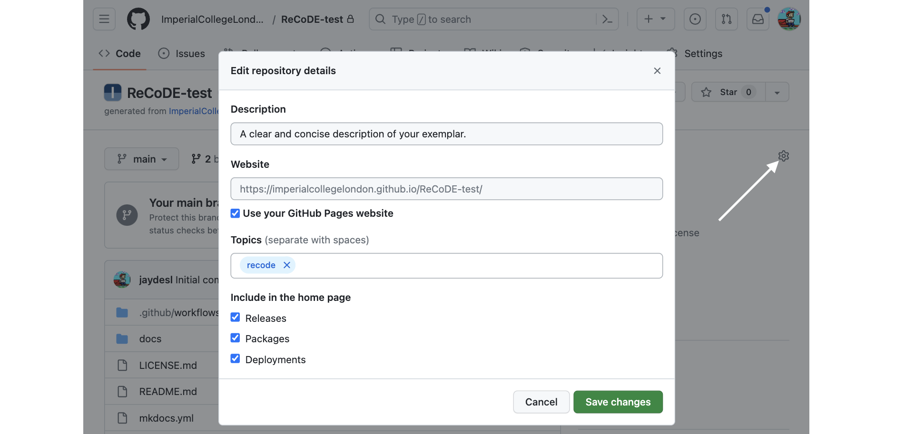

---
hide:
  - navigation
  - title
search:
  exclude: true
---

<style>
  .gs-about {
    position: relative;
    width: 350px;
    left: 60%;
    margin-top: -10%;
    margin-bottom: -4%;
  }

  @media (max-width: 1024px) {
    .gs-about {
      position: relative;
      width: 30%;
      left: 0%;
      margin-top: -5%;
    }
  }

  @media (max-width: 720px) {
    .gs-about {
      position: relative;
      width: 90%;
      left: 5%;
      margin-top: -5%;
    }
  }

</style>

# Developing your exemplar


## Background

If selected to contribute to ReCoDE, you will develop your exemplar in a GitHub repository within the Imperial College organisation. You will work with an RSE and RCDS tutor, the details of which can be found on the [Contributing](contribute.md) page.

## Timeline

Before diving into coding, it is important that you meet the team, establish a plan of work, and learn to work with GitHub. The sections below establish some high-level priorities that all exemplar development teams should focus on. You and your team will establish more specific goals and milestones to work towards in addition to the points below.

### Week 0: Community Meetup

The ReCoDE coordinators will set up a initial meeting of the current ReCoDE community. You will be asked to fill out and bring along a project proposal plan, which will contain more details about your proposed exemplar. At this meetup, there will be a short session on using GitHub to collaborate with a development team.

### Week 1: Team Kick-off

You, your RSE and RCDS tutor should aim to meet soon after the community meetup. In this call, you can schedule a weekly recurring meeting, establish a project timeline and set weekly goals. Between holidays and conferences, it will be difficult to meet every week, but schedule yourselves as best you can and try to touch base with the team often.

### Week 2: README

In week 2, aim to open a Pull Request that adds content to the README in your GitHub repository, following the template. You can request reviews from both the RSE and RCDS on this item and address any review comments/feedback. Once your changes are approved and merged, check the GitHub Pages site to see how your published content appears.

### Weeks 3 - 6: Minimum Working Example

Aim to produce a minimum working example of your exemplar by the midway point of the timeline. At this point your GitHub repository will contain a minimal but working codebase, and your GitHub Pages site will have at least an introduction and one other page or notebook.

### Weeks 6 - 12: Finalising

During the latter half of the project continue to work to the timeline you established with your team to complete, finalise and share your exemplar with the world!


## Preparing the repository

The steps below will guide you to create a new repository in the Imperial College London GitHub organisation. You will need a short but meaningful name for the repostiory, which should follow the convention: `ReCoDE-name-of-my-exemplar`. You should determine a structure for your code with your RSE mentor. For the learning annotation, we suggest presenting this using [MkDocs](https://www.mkdocs.org/), so that it will start you off with a templated repository that is MkDocs-ready. If you wish to use a different approach (e.g. Sphinx, Quarto) please discuss this with your team.

### Register on the Imperial GitHub

Please follow the steps at the [following link](https://www.imperial.ac.uk/admin-services/ict/self-service/research-support/research-support-systems/github/working-with-githubcom/) to gain access to the Imperial GitHub organisation. There are also instructions on creating a new GitHub account, in case you do not already have one.

### Use the template

Navigate to the [following GitHub repository](https://github.com/ImperialCollegeLondon/ReCoDE-exemplar-template), which contains the template for all ReCoDE projects. Click the big green **Use this template** button to set up your own repository.



Complete the fields in the window that appears, and click **Create repository**. Ensure the following:

- Tick the **Include all branches** option
- Ensure **Owner** is set to **ImperialCollegeLondon**
- Ensure **Repository name** follows the format **ReCoDE-*Your-Exemplar-Name***
- Add a **Description**
- Set the repository visibility to **Internal**



### Add collaborators

In a few moments, your new repository will be ready. There are a few things to setup, so click the **Settings** button along the horizontal menu bar.


Click the **Collaborators and teams** button on the left side bar. In the new frame, click **Add teams** to search for and add **RCDS** (*ImperialCollegeLondon/rcds*), assigning the **Admin** role. This will allow the Research Computing and Data Science group to support the exemplar during its development and once it is published.



### Configure GitHub Pages

Also in settings, find and click the **Pages** button down the left side bar. In this new frame, set **GitHub Pages visibility** to **Public** and confirm the change.



Head back to the **Code** section of the repository using the menu bar. On the right side panel, you will see a small gear icon to set repository details. Please tick the **Use your GitHub Pages website** and add **recode** to the **Topics** field. If you want to modify the **Description** you are able to do that here too.



### Adjust MkDocs settings

MkDocs is a static site generator that is particularly well suited to creating rich documentation. It works by rendering Markdown files and Jupyter Notebooks into HTML and wrapping the site up into a nice theme with responsive navigation and a search.

On each commit to your repository, a GitHub action will automatically update and publish the latest version of your site. This action, and most of the MkDocs configuration are set up by the template. There are however two small changes to make to the `mkdocs.yml` file in the root of your repository.

Edit `mkdocs.yml`, changing the **site_name** to **ReCoDE *Your Exemplar Name*** and changing **repo_url** to the GitHub URL of your new repository (the repository - **not** the GitHub Pages link).


### Populate the repository

You are now ready to start developing your exemplar. The template includes the following directories, and if you have decided to use MkDocs, the structure should be left as is. For other publishing formats, this structure may change - please discuss with the team.


#### Jupyter Notebooks

If your exemplar includes Jupyter Notebooks, place these in the `notebooks/` directory. If additional packages are required, please add these to `requirements.txt`, below the requirements already there. If your Notebooks contain images, please place them in a new directory in `notebooks/` for example at `notebooks/img/my_image.png`.

#### Markdown

Any other files should be authored in Markdown and placed into `docs/`. Your site is themed by [Mkdocs Material](https://squidfunk.github.io/mkdocs-material/).
The [documentation](https://squidfunk.github.io/mkdocs-material/reference/) is
excellent and should provide a good starting point for enchancing your Markdown.

!!! tip Ordering files
    
    You may find it helpful to prefix your files with a number, to ensure the correct ordering of
    your Markdown and Notebook files. (e.g. `01-Intro.md`, `02-FirstSteps.ipynb`)


### Local MkDocs Development

After cloning your repository, you can install all the necessary dependencies into your environment
(preferably a virtual one) and serve the site locally at http://127.0.0.1:8000 with these two commands:

```bash
pip install -r requirements.txt
python -m mkdocs serve
```
