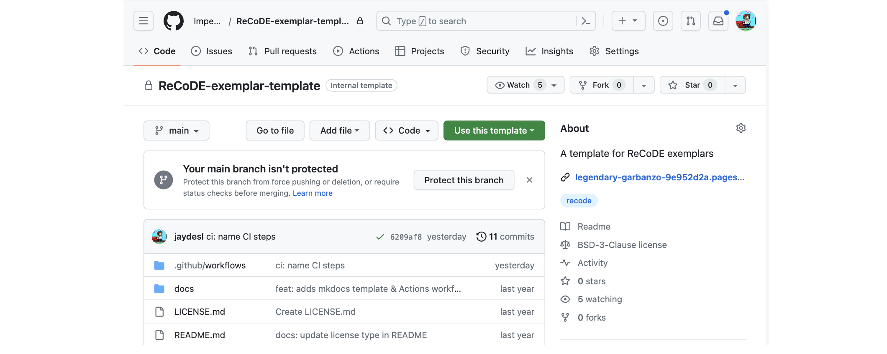
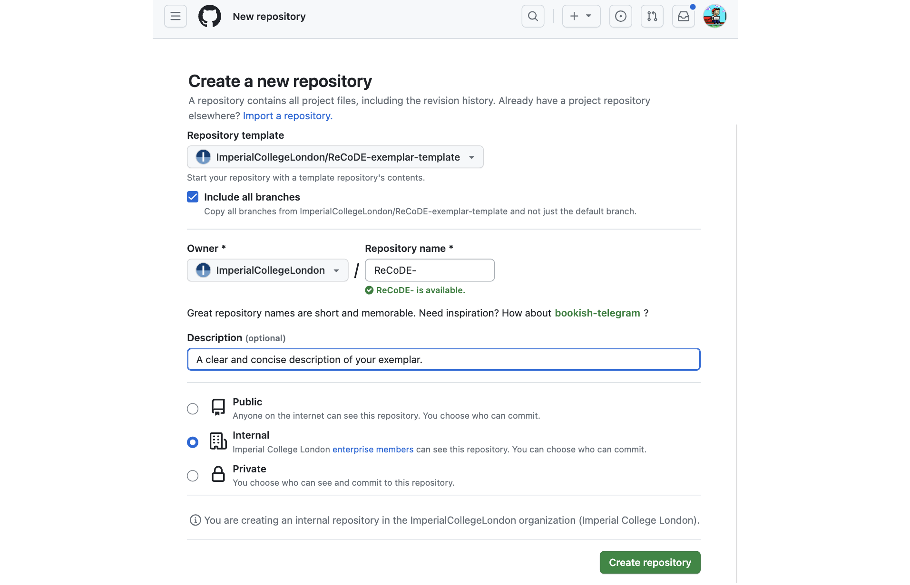
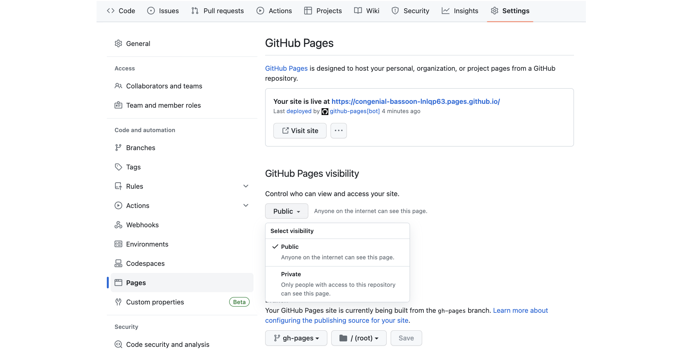
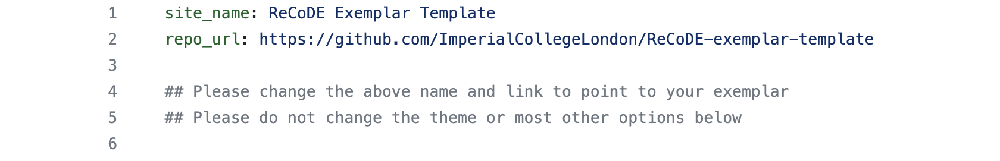

---
hide:
  - navigation
  - title
search:
  exclude: true
---

<style>
  .gs-about {
    position: relative;
    width: 350px;
    left: 60%;
    margin-top: -10%;
    margin-bottom: -4%;
  }

  @media (max-width: 1024px) {
    .gs-about {
      position: relative;
      width: 30%;
      left: 0%;
      margin-top: -5%;
    }
  }

  @media (max-width: 720px) {
    .gs-about {
      position: relative;
      width: 90%;
      left: 5%;
      margin-top: -5%;
    }
  }

</style>

# Developing your exemplar


## Background

If selected to [contribute to ReCoDE](contribute.md), you will develop your exemplar in a GitHub repository within the Imperial College organisation. The name will follow the convention: *ReCoDE-name-of-project*. We usually present the repository using [MkDocs](https://www.mkdocs.org/), so you will start with a templated repository that is MkDocs-ready.

## Register on the Imperial GitHub

Please follow the steps at the [following link](https://www.imperial.ac.uk/admin-services/ict/self-service/research-support/research-support-systems/github/working-with-githubcom/) to gain access to the Imperial GitHub organisation. There are also instructions on creating a new GitHub account, in case you do not already have one.

## Use the template

Navigate to the [following GitHub repository](https://github.com/ImperialCollegeLondon/ReCoDE-exemplar-template), which contains the template for all ReCoDE projects. Click the big green **Use this template** button to set up your own repository.



Complete the fields in the window that appears, and click **Create repository**. Ensure the following:

- Tick the **Include all branches** option
- Ensure **Owner** is set to **ImperialCollegeLondon**
- Ensure **Repository name** follows the format **ReCoDE-*Your-Exemplar-Name***
- Add a **Description**
- Set the repository visibility to **Internal**



## Add collaborators

In a few moments, your new repository will be ready. There are a few things to setup, so click the **Settings** button along the horizontal menu bar.


Click the **Collaborators and teams** button on the left side bar. In the new frame, click **Add teams** to search for and add **RCDS** (*ImperialCollegeLondon/rcds*), assigning the **Admin** role. This will allow the Research Computing and Data Science group to support the exemplar during its development and once it is published.


## GitHub Pages Configuration

Also in settings, find and click the **Pages** button down the left side bar. In this new frame, set **GitHub Pages visibility** to **Public** and confirm the change.



Head back to the **Code** section of the repository using the menu bar. On the right side panel, you will see a small gear icon to set repository details. Please tick the **Use your GitHub Pages website** and add **recode** to the **Topics** field. If you want to modify the **Description** you are able to do that here too.


## MkDocs Settings

MkDocs is a static site generator that is particularly well suited to creating rich documentation. It works by rendering Markdown files and Jupyter Notebooks into HTML and wrapping the site up into a nice theme with responsive navigation and a search.

On each commit to your repository, a GitHub action will automatically update and publish the latest version of your site. This action, and most of the MkDocs configuration are set up by the template. There are however two small changes to make to the `mkdocs.yml` file in the root of your repository.

Edit `mkdocs.yml`, changing the **site_name** to **ReCoDE *Your Exemplar Name*** and changing **repo_url** to the GitHub URL of your new repository (the repository - **not** the GitHub Pages link).



## Populating the repository

You are now ready to start developing your exemplar. The template includes the following directories, and the structure should be left as is.


### Jupyter Notebooks

If your exemplar includes Jupyter Notebooks, place these in the `notebooks/` directory. If additional packages are required, please add these to `requirements.txt`, below the requirements already there. If your Notebooks contain images, please place them within the same directory, for example at `notebooks/img`.

### Markdown

Any other files should be authored in Markdown and placed into `docs/`. Your site is themed by [Mkdocs Material](https://squidfunk.github.io/mkdocs-material/).
The [documentation](https://squidfunk.github.io/mkdocs-material/reference/) is
excellent and should provide a good starting point for enchancing your Markdown.

!!! tip Ordering files
    
    You may find it helpful to prefix your files with a number, to ensure the correct ordering of
    your Markdown and Notebook files. (e.g. `01-Intro.md`)


## Local MkDocs Development

After cloning your repository, you can install all the necessary dependencies into your environment
(preferably a virtual one) and serve the site locally at http://127.0.0.1:8000 with these two commands:

```bash
pip install -r requirements.txt
python -m mkdocs serve
```
