

-  <big>__Mathematics of the Mandlebrot Set__</big>
     Juan Carlos Bilbao-Ludena

    ---
    
    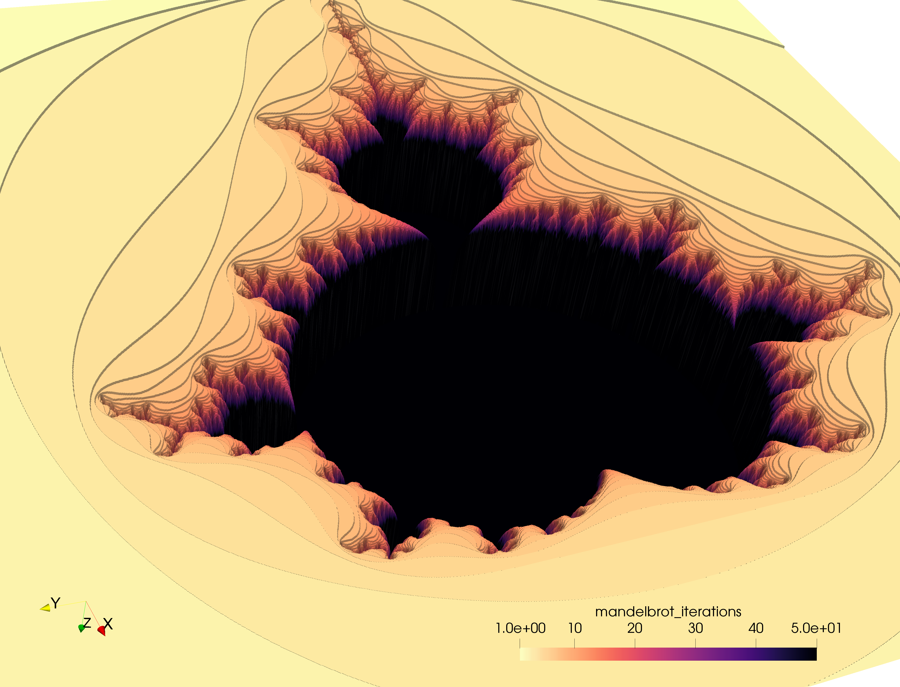

    <big>[__:octicons-arrow-right-24: Get Started__](https://imperialcollegelondon.github.io/ReCoDE-Exploration-Mandelbrot-Set/)</big>

    [:octicons-tag-24: C++, Parallel Computing, Visualisation](../tags)
    
    <small>:fontawesome-brands-github: [See it on GitHub](https://github.com/ImperialCollegeLondon/ReCoDE-Exploration-Mandelbrot-Set)</small>

-  <big>__Neural Ordinary Differential Equations__</big>
     Ekin Ozturk

    ---
    
    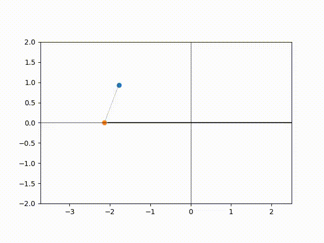

    <big>[__:octicons-arrow-right-24: Get Started__](https://imperialcollegelondon.github.io/ReCoDE-NeuralODEs/)</big>

    [:octicons-tag-24: Python, Machine Learning, PyTorch, Ordinary Differential Equations](../tags)
    
    <small>:fontawesome-brands-github: [See it on GitHub](https://github.com/ImperialCollegeLondon/ReCoDE-NeuralODEs)</small>

-  <big>__Predicting Colitis with Penalised Regression__</big>
     Fabio Feser

    ---
    
    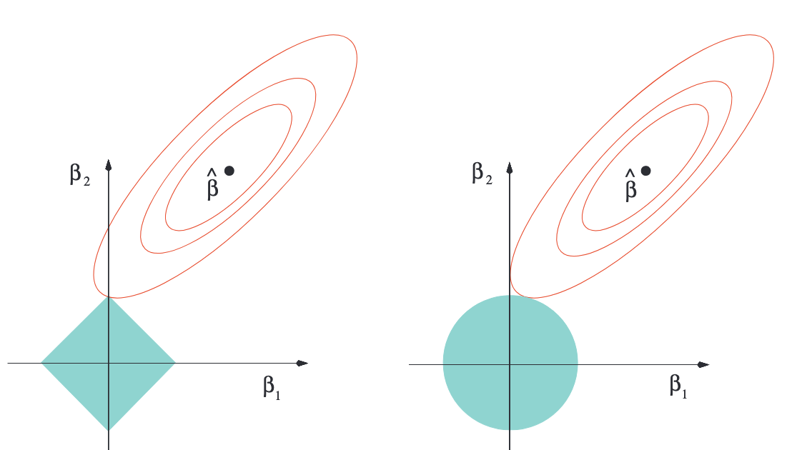

    <big>[__:octicons-arrow-right-24: Get Started__](https://imperialcollegelondon.github.io/ReCoDE-penalised-reg/)</big>

    [:octicons-tag-24: R, Statistics, Logistic Regression](../tags)
    
    <small>:fontawesome-brands-github: [See it on GitHub](https://github.com/ImperialCollegeLondon/ReCoDE-penalised-reg/)</small>

-  <big>__Environmental Literature Analysis with BERTopic & RoBERTa__</big>
     Yurong Yu

    ---
    
    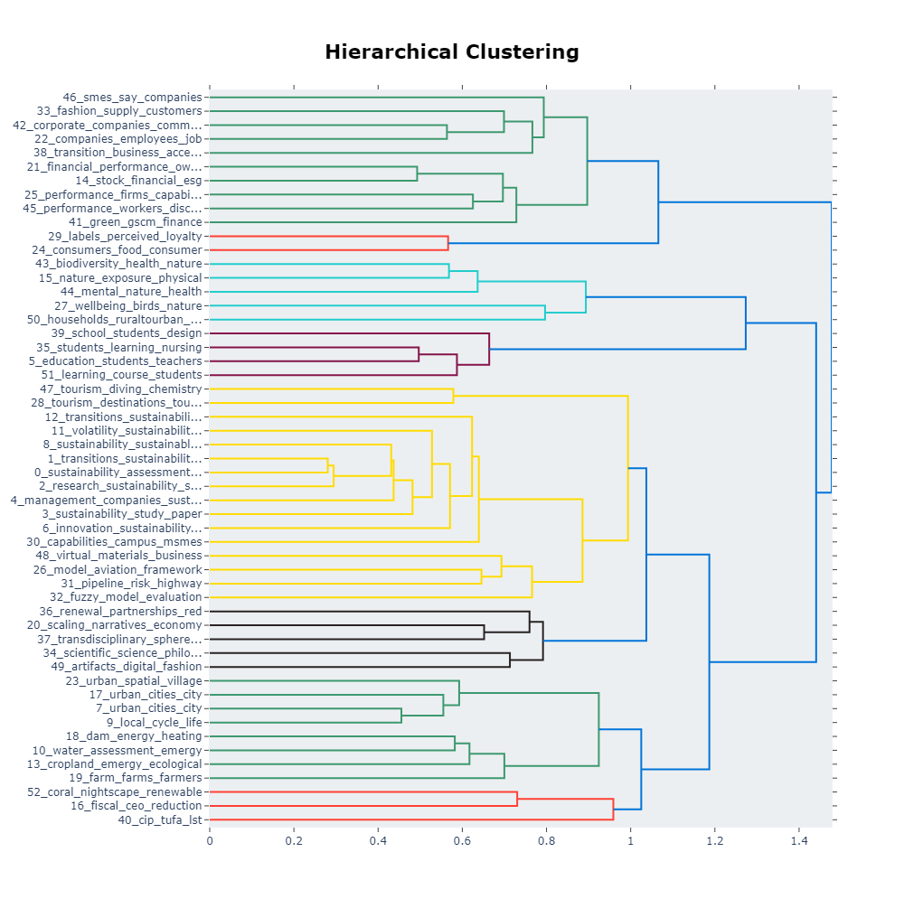

    <big>[__:octicons-arrow-right-24: Get Started__](https://imperialcollegelondon.github.io/ReCoDE-Analysis-of-environmental-literature-with-BERTopic-and-RoBERTa/)</big>

    [:octicons-tag-24: Topic Modelling, BERTopic, RoBERTa](../tags)
    
    <small>:fontawesome-brands-github: [See it on GitHub](https://github.com/ImperialCollegeLondon/ReCoDE-Analysis-of-environmental-literature-with-BERTopic-and-RoBERTa)</small>

-  <big>__Cracking Time's Code: Survival Analysis of Large Datasets__</big>
     Valentina Quintero Santofimio

    ---
    
    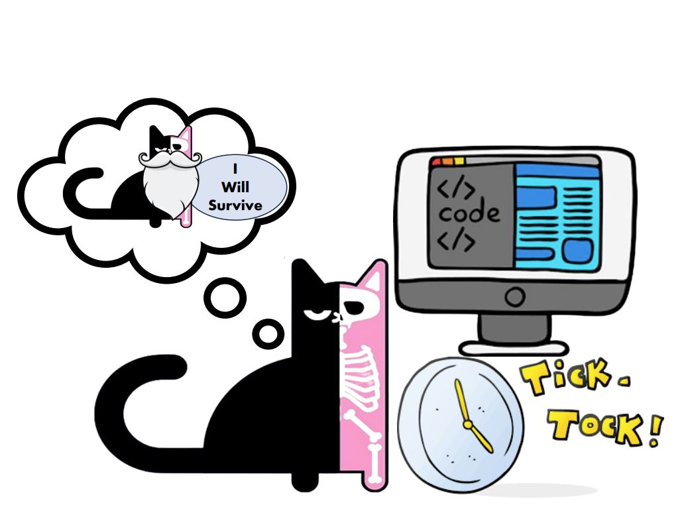

    <big>[__:octicons-arrow-right-24: Get Started__](https://imperialcollegelondon.github.io/ReCoDE-SurvivalAnalysis/)</big>

    [:octicons-tag-24: R, Epidemiology, Statistics](../tags)
    
    <small>:fontawesome-brands-github: [See it on GitHub](https://github.com/ImperialCollegeLondon/ReCoDE-SurvivalAnalysis/)</small>

-  <big>__Hand-eye Calibration of Medical Robots__</big>
     Zejian Cui

    ---
    
    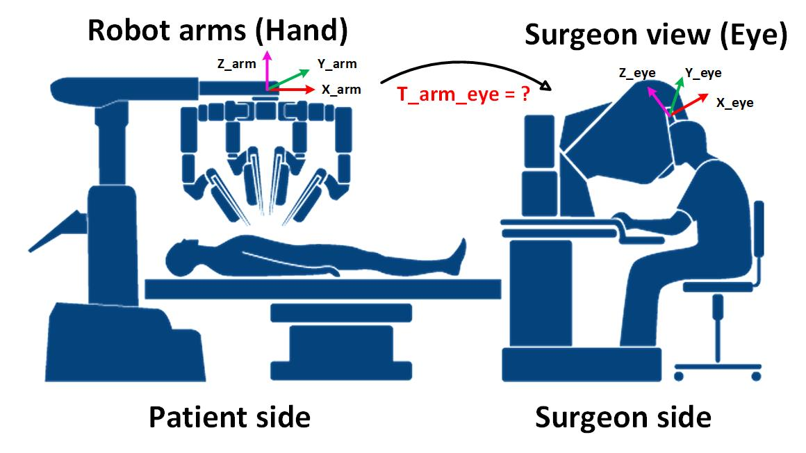

    <big>[__:octicons-arrow-right-24: Get Started__](https://imperialcollegelondon.github.io/ReCoDE-HandEyeCalibration/)</big>

    [:octicons-tag-24: C++, Robotics, Computer Vision](../tags)
    
    <small>:fontawesome-brands-github: [See it on GitHub](https://github.com/ImperialCollegeLondon/ReCoDE-HandEyeCalibration)</small>

-  <big>__Turing Patterns & Partial Differential Equations__</big>
     Elliot James Badcock

    ---
    
    

    <big>[__:octicons-arrow-right-24: Get Started__](https://imperialcollegelondon.github.io/ReCoDE-Turing-Patterns-and-Partial-Differential-Equations/)</big>

    [:octicons-tag-24: Fortran, Fortran Package Manager, Partial Differential Equations](../tags)
    
    <small>:fontawesome-brands-github: [See it on GitHub](https://github.com/ImperialCollegeLondon/ReCoDE-Turing-Patterns-and-Partial-Differential-Equations)</small>

-  <big>__Deep Learning Best Practices__</big>
     Antoni Bigata Casademunt

    ---
    
    

    <big>[__:octicons-arrow-right-24: Get Started__](https://imperialcollegelondon.github.io/ReCoDE-DeepLearning-Best-Practices/)</big>

    [:octicons-tag-24: Python, PyTorch, Machine Learning](../tags)
    
    <small>:fontawesome-brands-github: [See it on GitHub](https://github.com/ImperialCollegeLondon/ReCoDE-DeepLearning-Best-Practices)</small>

-  <big>__SPH Solver for 2D Navier-Stokes__</big>
     Georgios Efstathiou

    ---
    
    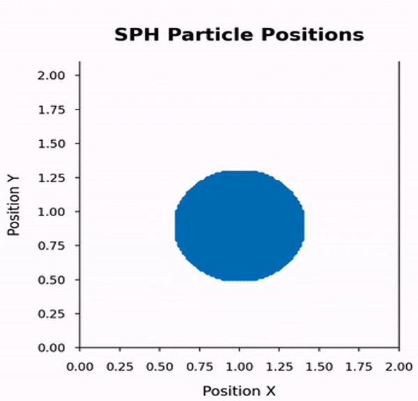

    <big>[__:octicons-arrow-right-24: Get Started__](https://imperialcollegelondon.github.io/ReCoDE-SPH-solver-2D-NS/)</big>

    [:octicons-tag-24: Python, C++, Boost](../tags)
    
    <small>:fontawesome-brands-github: [See it on GitHub](https://github.com/ImperialCollegeLondon/ReCoDE-SPH-solver-2D-NS/)</small>

-  <big>__Hidden Markov Models for the discovery of behavioural states__</big>
     Laurence Blackhurst

    ---
    
    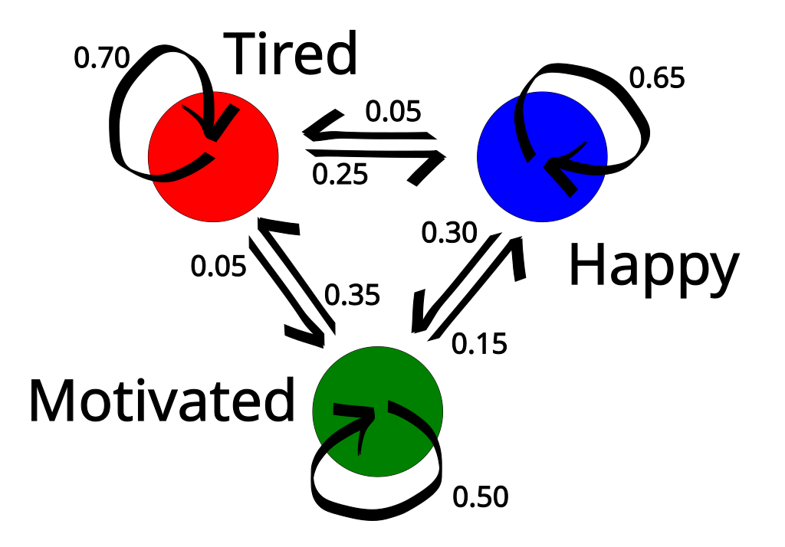

    <big>[__:octicons-arrow-right-24: Get Started__](https://imperialcollegelondon.github.io/ReCoDE-HMMs-for-the-discovery-of-behavioural-states)</big>

    [:octicons-tag-24: Python, Pandas, Machine Learning](../tags)
    
    <small>:fontawesome-brands-github: [See it on GitHub](https://github.com/ImperialCollegeLondon/ReCoDE-HMMs-for-the-discovery-of-behavioural-states)</small>

-  <big>__Decoding Market Signals__</big>
     Benjamin Scharpf

    ---
    
    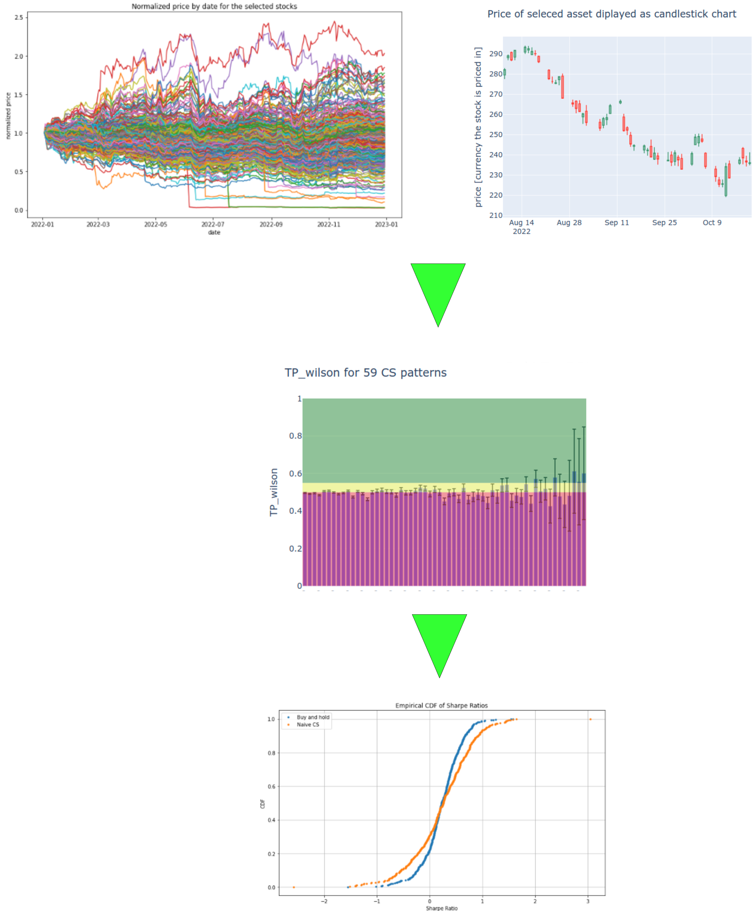

    <big>[__:octicons-arrow-right-24: Get Started__](https://imperialcollegelondon.github.io/ReCoDE-DecodingMarketSignals)</big>

    [:octicons-tag-24: Finance, Pandas, Logistic Regression](../tags)
    
    <small>:fontawesome-brands-github: [See it on GitHub](https://github.com/ImperialCollegeLondon/ReCoDE-DecodingMarketSignals)</small>

-  <big>__Binary Classification of Patent Texts__</big>
     Egheosa Ogbomo

    ---
    
    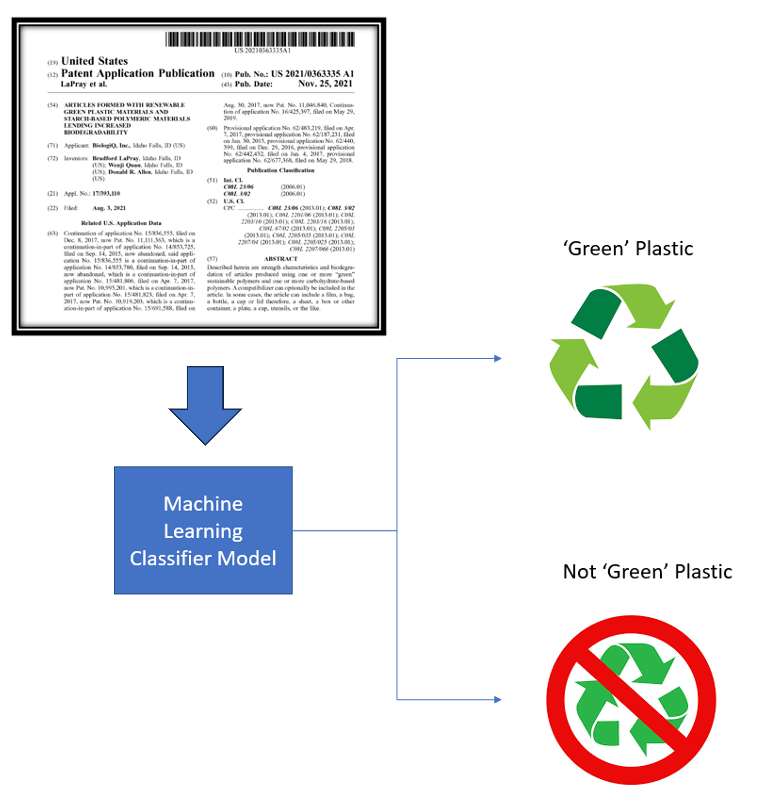

    <big>[__:octicons-arrow-right-24: Get Started__](https://imperialcollegelondon.github.io/ReCoDE-AIForPatents)</big>

    [:octicons-tag-24: Python, Tensorflow, Sci-kit Learn](../tags)
    
    <small>:fontawesome-brands-github: [See it on GitHub](https://github.com/ImperialCollegeLondon/ReCoDE-AIForPatents)</small>

-  <big>__CNNs for the Cosmic Dawn__</big>
     Kimeel Sooknunan

    ---
    
    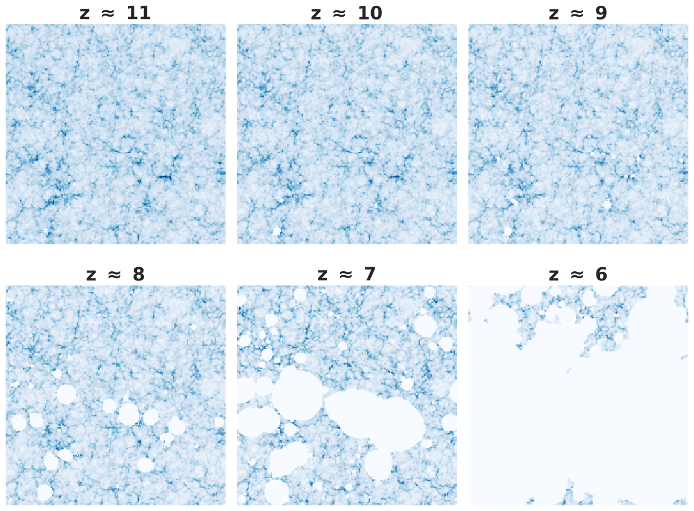

    <big>[__:octicons-arrow-right-24: Get Started__](https://imperialcollegelondon.github.io/ReCoDE-FirstDawn)</big>

    [:octicons-tag-24: Python, Tensorflow, Sci-kit Learn](../tags)
    

    <small>:fontawesome-brands-github: [See it on GitHub](https://github.com/ImperialCollegeLondon/ReCoDE-FirstDawn)</small>

-  <big>__Solving SDEs with Euler-Maruyama__</big>
     Antonio Malpica-Morales

    ---
    
    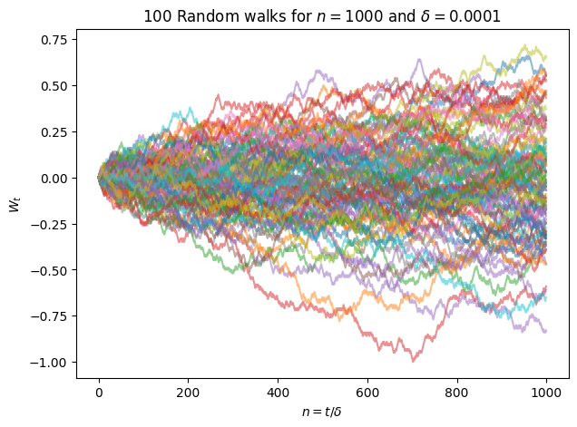

    <big>[__:octicons-arrow-right-24: Get Started__](https://imperialcollegelondon.github.io/ReCoDe-Euler-Maruyama)</big>

    [:octicons-tag-24: Python, NumPy, Matplotlib](../tags)
    
    <small>:fontawesome-brands-github: [See it on GitHub](https://github.com/ImperialCollegeLondon/ReCoDe-Euler-Maruyama)</small>

-  <big>__Multi-channel Python GUI__</big>
     Shuaixun Wang

    ---
    
    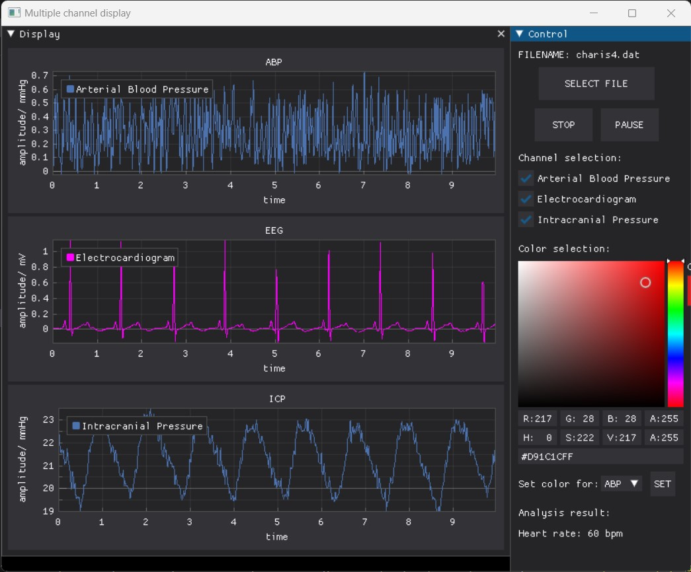

    <big>[__:octicons-arrow-right-24: Get Started__](https://imperialcollegelondon.github.io/ReCoDE-PythonGUI)</big>

    [:octicons-tag-24: Python, NumPy, GUI](../tags)
    
    <small>:fontawesome-brands-github: [See it on GitHub](https://github.com/ImperialCollegeLondon/ReCoDE-PythonGUI)</small>

-  <big>__RNA Sequencing Analysis__</big>
     Jack Gisby

    ---
    
    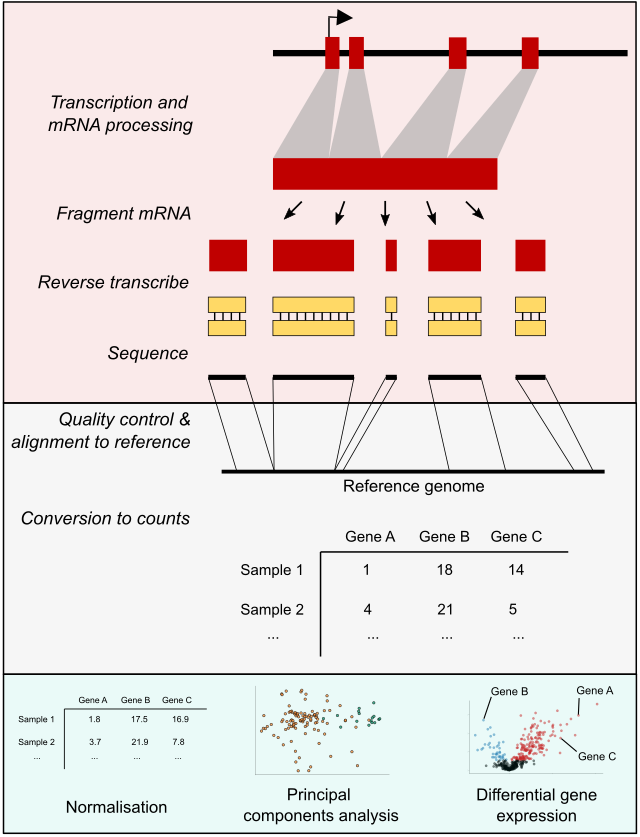

    <big>[__:octicons-arrow-right-24: Get Started__](https://imperialcollegelondon.github.io/ReCoDE_rnaseq_pipeline)</big>

    [:octicons-tag-24: R, bash, Conda, Nextflow](../tags)
    
    <small>:fontawesome-brands-github: [See it on GitHub](https://github.com/ImperialCollegeLondon/ReCoDE_rnaseq_pipeline)</small>

-  <big>__Bayesian Inference for SARS-CoV-2 Transmission Modelling__</big>
     Bethan C Daniels

    ---
    
    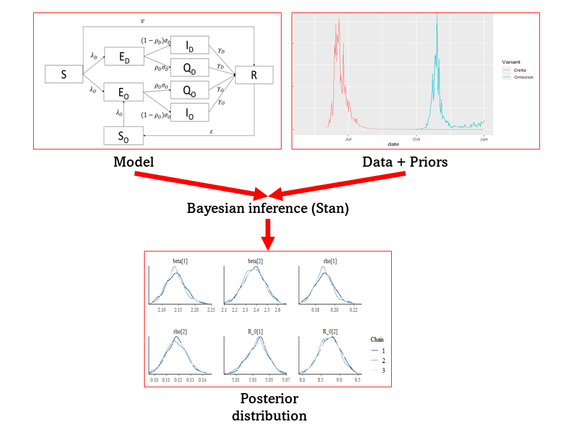

    <big>[__:octicons-arrow-right-24: Get Started__](https://imperialcollegelondon.github.io/ReCoDE_IDMS)</big>

    [:octicons-tag-24: R, Stan](../tags)
    
    <small>:fontawesome-brands-github: [See it on GitHub](https://github.com/ImperialCollegeLondon/ReCoDE_IDMS)</small>

-  <big>__1-Dimensional Neutron Diffusion Solver__</big>
     Jack Trainor

    ---
    
    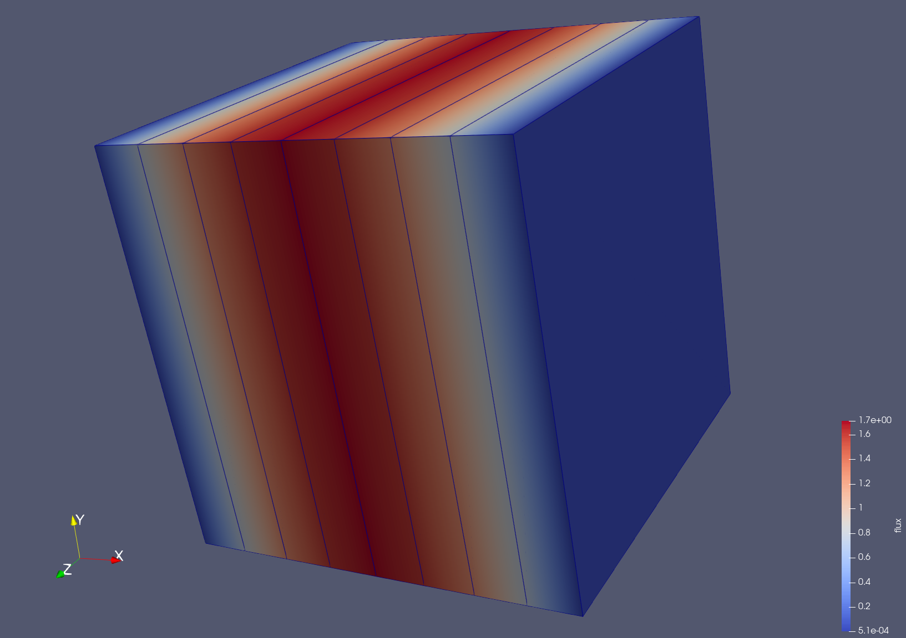

    <big>[__:octicons-arrow-right-24: Get Started__](https://imperialcollegelondon.github.io/ReCoDE_Diffusion_Code)</big>

    [:octicons-tag-24: Fortran, OOP](../tags)
    
    <small>:fontawesome-brands-github: [See it on GitHub](https://github.com/ImperialCollegeLondon/ReCoDE_Diffusion_Code)</small>

-  <big>__Markov Chain Monte Carlo for fun and profit__</big>
     Tom Hodson

    ---
    
    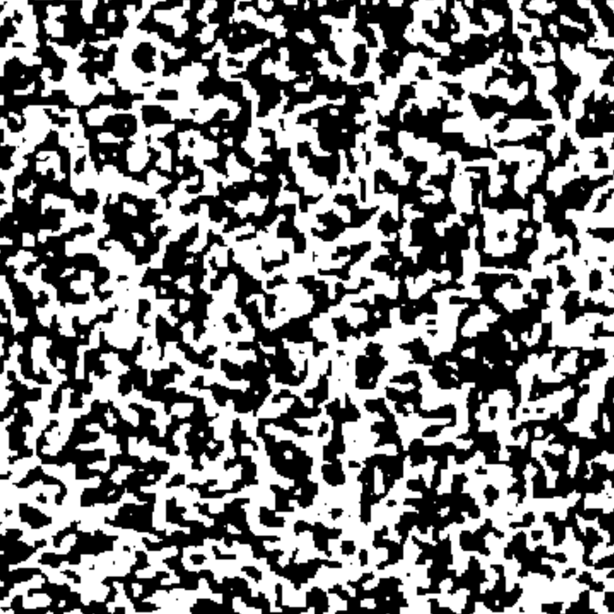

    <big>[__:octicons-arrow-right-24: Get Started__](https://recode-mcmcff.readthedocs.io/en/latest/)</big>

    [:octicons-tag-24: Python, TDD, Optimisation](../tags)
    
    <small>:fontawesome-brands-github: [See it on GitHub](https://github.com/ImperialCollegeLondon/ReCoDE_MCMCFF)</small>

-  <big>__PyTorch for end-to-end training of a deep learning model__</big>
     Emily Muller

    ---
    
    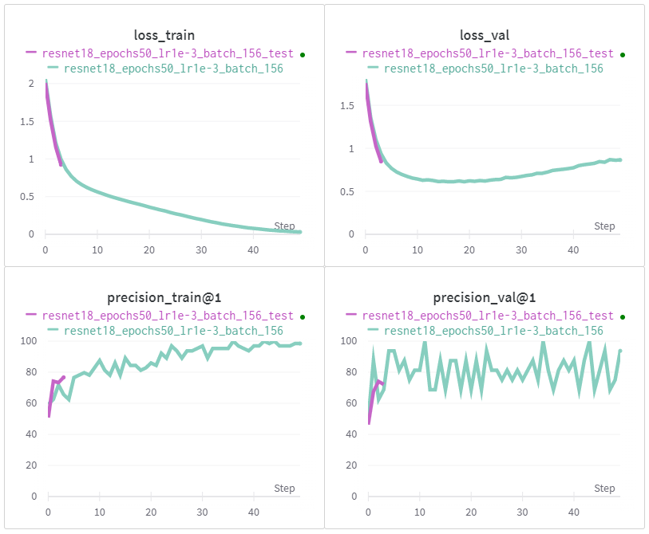

    <big>[__:octicons-arrow-right-24: Get Started__](https://imperialcollegelondon.github.io/recode-perceptions)</big>

    [:octicons-tag-24: Python, pyTorch, Machine Learning](../tags)
    
    <small>:fontawesome-brands-github: [See it on GitHub](https://github.com/ImperialCollegeLondon/recode-perceptions)</small>

