---
hide:
  - toc
  - navigation
search:
  exclude: true
---

# Team

=== "Authors"

    

    -  __Laurence Blackhurst__
        [:octicons-mail-24:](mailto: l.blackhurst19@imperial.ac.uk)

        ---
        
        {: style="max-height:225px;"}

        __:octicons-beaker-24: Hidden Markov Models__

    -  __Antoni Bigata Casademunt__
        [:octicons-mail-24:](mailto: a.bigata-casademunt22@imperial.ac.uk)

        ---
        
        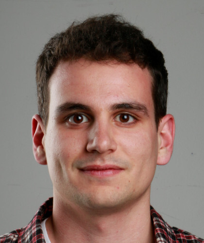{: style="max-height:225px;"}

        __:octicons-beaker-24: Deep Learning Best Practices__

    -  __Bethan C Daniels__
        [:octicons-mail-24:](mailto: bethan.cracknell-daniels19@imperial.ac.uk)

        ---
        
        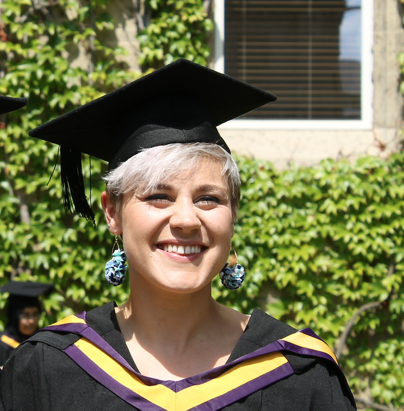{: style="max-height:225px;"}

        __:octicons-beaker-24: Transmission Modelling__

    -  __Georgios Efstathiou__
        [:octicons-mail-24:](mailto: georgios.efstathiou20@imperial.ac.uk)

        ---
        
        {: style="max-height:225px;"}

        __:octicons-beaker-24: SPH Solver for 2D Navier-Stokes__

    -  __Jack Gisby__
        [:octicons-mail-24:](mailto: j.gisby20@imperial.ac.uk)

        ---
        
        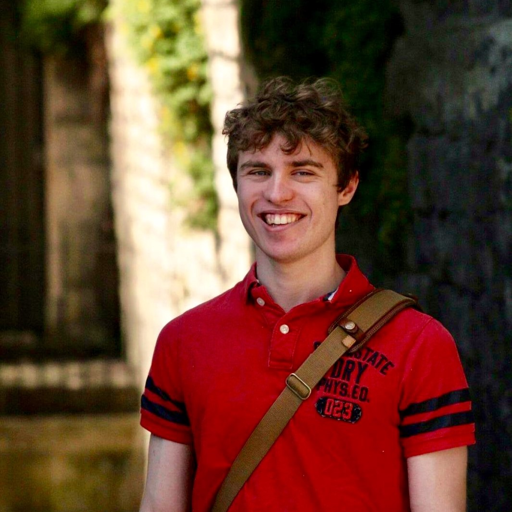{: style="max-height:225px;"}

        __:octicons-beaker-24: RNA Sequencing__   

    -  __Tom Hodson__
        [:octicons-mail-24:](mailto: t.hodson18@imperial.ac.uk)

        ---
        
        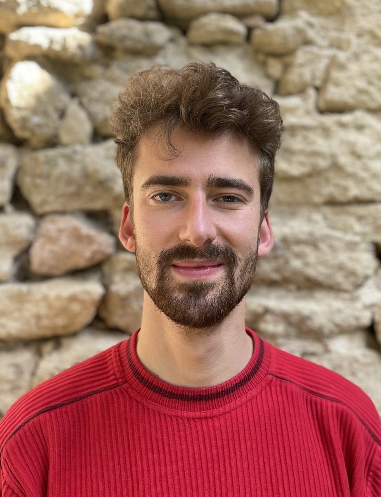{: style="max-height:225px;"}

        __:octicons-beaker-24: Markov Chain Monte Carlo__

    -  __Antonio Malpica-Morales__
        [:octicons-mail-24:](mailto: a.malpica-morales21@imperial.ac.uk)

        ---
        
        {: style="max-height:225px;"}

        __:octicons-beaker-24: SDEs with Euler-Maruyama__

    -  __Emily Muller__
        [:octicons-mail-24:](mailto: emily.muller@imperial.ac.uk)

        ---
        
        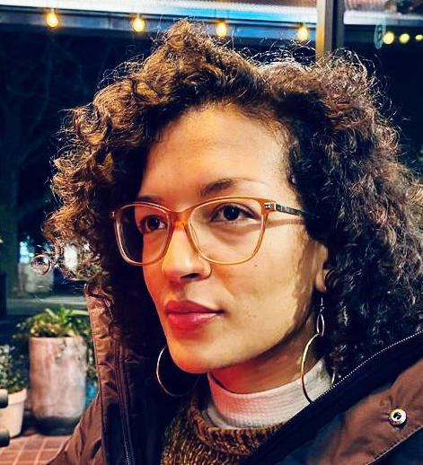{: style="max-height:225px;"}

        __:octicons-beaker-24: Perceptions__

    -  __Egheosa Ogbomo__
        [:octicons-mail-24:](mailto: e.ogbomo21@imperial.ac.uk)

        ---
        
        {: style="max-height:225px;"}

        __:octicons-beaker-24: AI for Patents__

    -  __Benjamin Scharpf__
        [:octicons-mail-24:](mailto: b.scharpf19@imperial.ac.uk)

        ---
        
        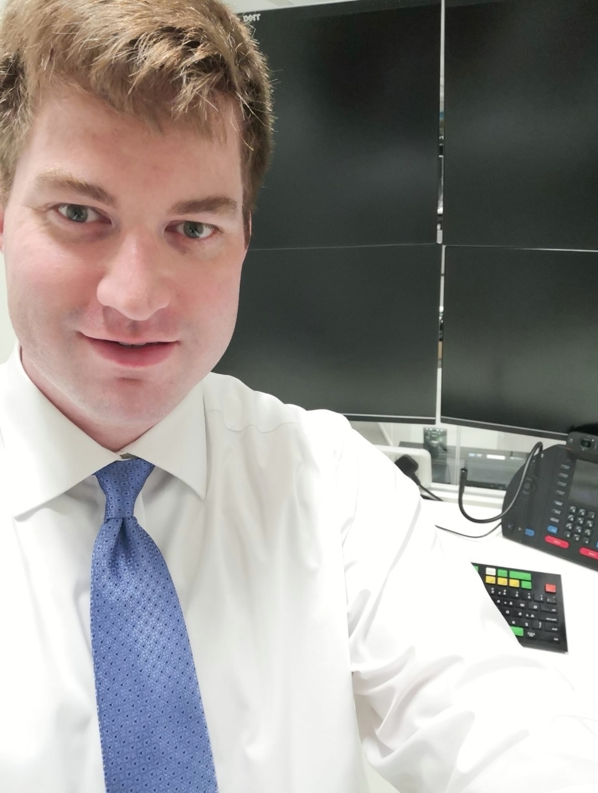{: style="max-height:225px;"}

        __:octicons-beaker-24: Decoding Market Signals__

    -  __Kimeel Sooknunan__
        [:octicons-mail-24:](mailto: k.sooknunan19@imperial.ac.uk)

        ---
        
        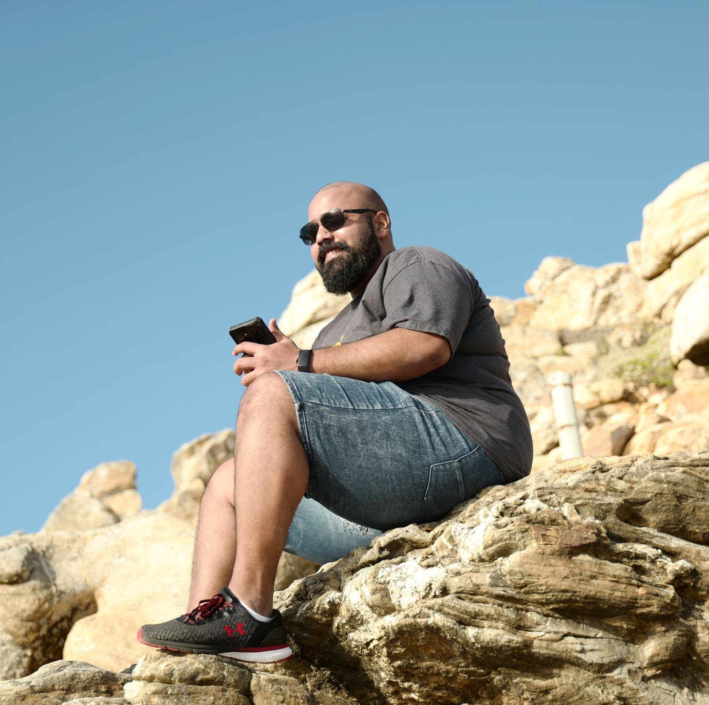{: style="max-height:225px;"}

        __:octicons-beaker-24: CNNs for Cosmic Dawn__

    -  __Jack Trainor__
        [:octicons-mail-24:](mailto: j.trainor20@imperial.ac.uk)

        ---
        
        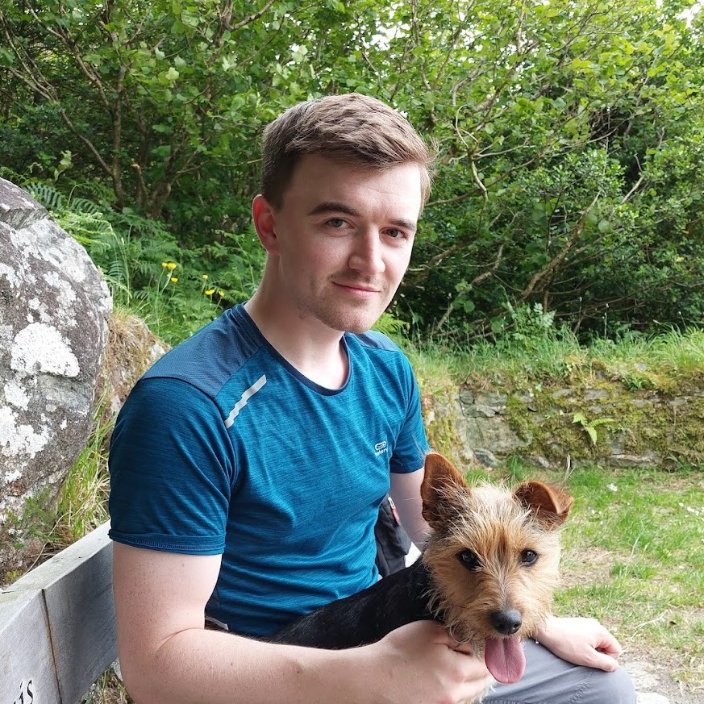{: style="max-height:225px;"}

        __:octicons-beaker-24: Neutron Diffusion__

    -  __Shuaixun Wang__
        [:octicons-mail-24:](mailto: shuaixun.wang20@imperial.ac.uk)

        ---
        
        {: style="max-height:225px;"}

        __:octicons-beaker-24: Multi-channel Python GUI__
      
    

=== "Student Shapers"

    

    -  __Jahnavi Bhaskaran__
        [:octicons-mail-24:](mailto: j.bhaskaran21@lms.mrc.ac.uk)

        ---
        
        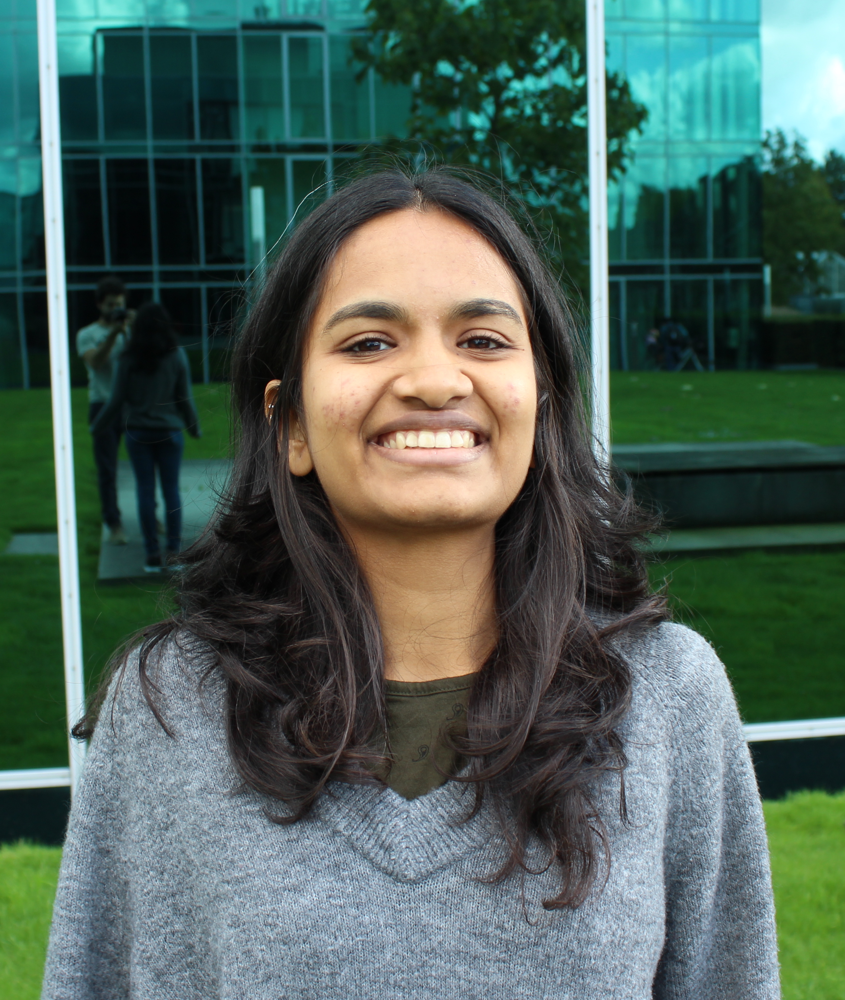{: style="max-height:225px;"}

    -  __Giannis Nikiteas__
        [:octicons-mail-24:](mailto: ioannis.nikiteas17@imperial.ac.uk)

        ---
        
        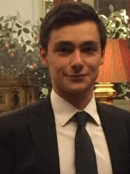{: style="max-height:225px;"}

    

=== "Project Coordinators"

    

    -  __Jeremy Cohen__
        [:octicons-mail-24:](mailto: jeremy.cohen@imperial.ac.uk)
        [:octicons-organization-24:](https://www.imperial.ac.uk/people/jeremy.cohen)

        ---
        
        {: style="max-height:225px;"}

    -  __Chris Cooling__
        [:octicons-mail-24:](mailto: c.cooling10@imperial.ac.uk)
        [:octicons-organization-24:](https://www.imperial.ac.uk/people/c.cooling10)

        ---
        
        {: style="max-height:225px;"}

    -  __Jay DesLauriers__
        [:octicons-mail-24:](mailto: j.deslauriers@imperial.ac.uk)
        [:octicons-organization-24:](https://www.imperial.ac.uk/people/j.deslauriers)

        ---
        
        {: style="max-height:225px;"}

    -  __Liam (Jianliang) Gao__
        [:octicons-mail-24:](mailto: j.gao@imperial.ac.uk)
        [:octicons-organization-24:](https://www.imperial.ac.uk/people/j.gao)

        ---
        
        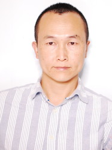{: style="max-height:225px;"}

    -  __Katerina Michalickova__
        [:octicons-mail-24:](mailto: k.michalickova@imperial.ac.uk)
        [:octicons-organization-24:](https://www.imperial.ac.uk/people/k.michalickova)

        ---
        
        {: style="max-height:225px;"}

    -  __John Pinney__
        [:octicons-mail-24:](mailto: j.pinney@imperial.ac.uk)
        [:octicons-organization-24:](https://www.imperial.ac.uk/people/j.pinney)

        ---
        
        {: style="max-height:225px;"}

    

=== "Research Software Engineers"

    

    -  __Diego Alonso Alvarez__
        [:octicons-mail-24:](mailto: d.alonso-alvarez@imperial.ac.uk)
        [:octicons-organization-24:](https://www.imperial.ac.uk/people/d.alonso-alvarez)

        ---
        
        {: style="max-height:225px;"}

    -  __Christopher Cave-Ayland__
        [:octicons-mail-24:](mailto: c.cave-ayland@imperial.ac.uk)

        ---
        
        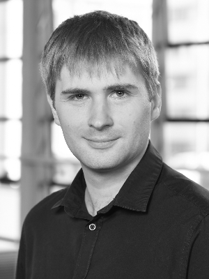{: style="max-height:225px;"}

    -  __Daniel Cummins__
        [:octicons-mail-24:](mailto: daniel.cummins17@imperial.ac.uk)
        [:octicons-organization-24:](https://www.imperial.ac.uk/people/daniel.cummins17)

        ---
        
        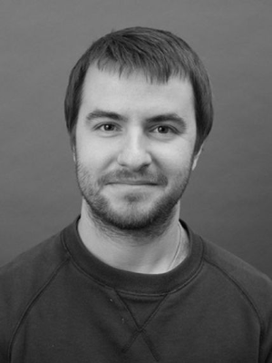{: style="max-height:225px;"}

    -  __Adrian D'Alessandro__
        [:octicons-mail-24:](mailto: a.dalessandro@imperial.ac.uk)
        [:octicons-organization-24:](https://www.imperial.ac.uk/people/a.dalessandro)

        ---
        
        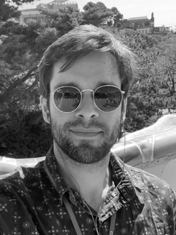{: style="max-height:225px;"}

    -  __Alexander Dewar__
        [:octicons-mail-24:](mailto: a.dewar@imperial.ac.uk)
        [:octicons-organization-24:](https://www.imperial.ac.uk/people/a.dewar)

        ---
        
        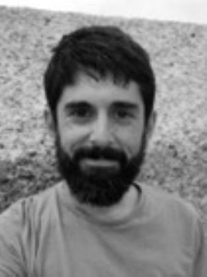{: style="max-height:225px;"}

    -  __James Turner__
        [:octicons-mail-24:](mailto: james.turner@imperial.ac.uk)
        [:octicons-organization-24:](https://www.imperial.ac.uk/people/james.turner)

        ---
        
        {: style="max-height:225px;"}

    -  __Ryan Smith__
        [:octicons-mail-24:](mailto: ryan.smith@imperial.ac.uk)
        [:octicons-organization-24:](https://www.imperial.ac.uk/people/ryan.smith)

        ---
        
        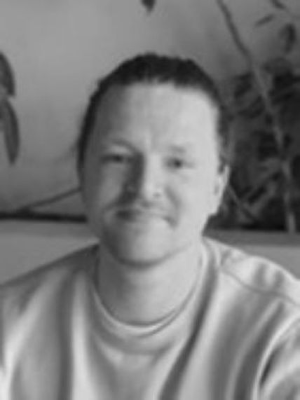{: style="max-height:225px;"}

    
